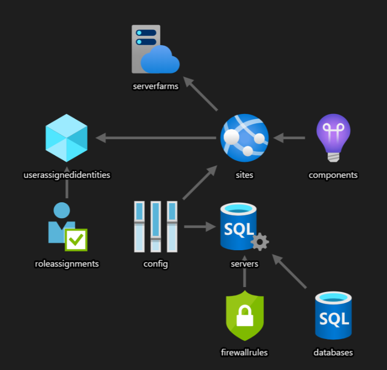

# A common architecture deployed with Bicep
We think a common architecture for Azure customers is Web App + Data + Managed Identity + Monitoring.


**How easy it to deploy this with Bicep?**
1. [Install Bicep CLI and VS Code extension](https://github.com/Azure/bicep/blob/main/docs/installing.md)
2. Use examples from Bicep repo to copy/paste for starting point
   - [web-app-sql-database](https://github.com/Azure/bicep/blob/main/docs/examples/201/web-app-sql-database/main.bicep)
   - [create-managedidentity-rbac](https://github.com/Azure/bicep/blob/main/docs/examples/101/create-managedidentity-rbac/main.bicep)
3. Arrange/re-order, update variables and params to preference
4. Update tenant param value with the id of your Azure AD tenant
5. Reference identity in web app using ``` '${msi.id}' ```:

            resource webSite 'Microsoft.Web/sites@2020-06-01' = {
               name: webSiteName
               location: location
               tags: {
                  'hidden-related:${hostingPlan.id}': 'empty'
                  displayName: 'Website'
               }
               properties: {
                  serverFarmId: hostingPlan.id
               }
               identity: {
                  type:'UserAssigned'
                  userAssignedIdentities:{
                     '${msi.id}': {}
                  }
               }
            }

6. Use Bicep CLI to Run Bicep Build command: ``` Bicep Build ./Infrastructure.bicep ``` to generate ARM Template (Infrastructure._json_)
7. Disregard the warning :warning:: ``` Warning BCP081: Resource type "Microsoft.Web/sites/config@2020-06-01" does not have types available. ```
   Issue being tracked here: https://github.com/Azure/bicep/issues/657
8. Create resource group to deploy to using Azure CLI: ``` az group create --name CommonArchitectureResourceGroup --location centralus ```
9. Deploy to resource group using Azure CLI: ``` az deployment group create -f ./Infrastructure.json -g CommonArchitectureResourceGroup ```
10. Enter parameters values for sqlAdministratorLogin, sqlAdministratorPassword at command line.
11. Hopefully you see no errors
12. Deployment complete!
